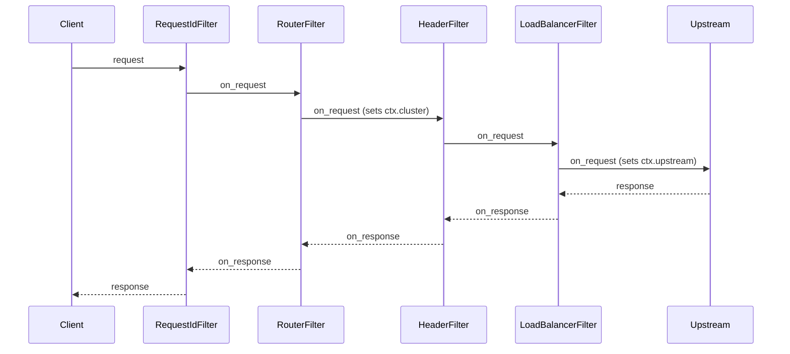
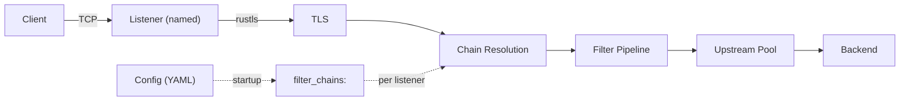
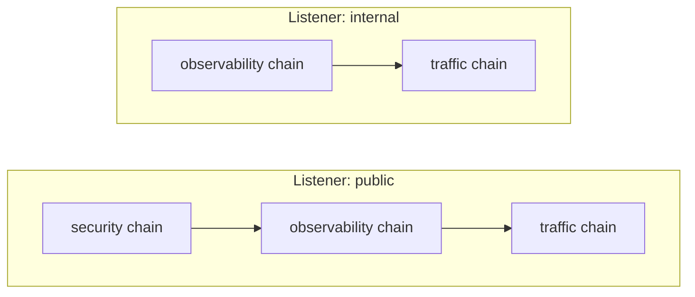
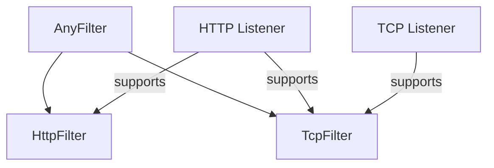

# Architecture Overview

## Design Principles

**Fast.** Performance is a primary design goal.

**Secure by default.** Security is a primary design goal.

**Composable.** Everything is a filter. Cluster routing,
load balancing, rate limiting, body-based routing: all
filters, all using the same traits, all assembled into
pipelines through named chains.

**Extensible.** Your filters implement the same [`HttpFilter`]
and [`TcpFilter`] traits as built-in filters. Register with
one macro.

**Adaptive.** Praxis is a framework for building proxies,
not just a proxy. Use a provided build out of the box, or
compose a bespoke proxy server from the same primitives.

[`HttpFilter`]:../filters/README.md
[`TcpFilter`]:../filters/README.md

## Primary Use-Cases

- **Ingress**: Reverse proxy, API gateway, edge proxy
- **Egress**: Outbound proxy, service-to-service
- **East/West**: Sidecar or converged proxy for service mesh
- **Security Gateway**: Guardrails, Network Policy

## System Architecture

### Protocol Adapters

Adapters translate upstream library callbacks into pipeline
invocations. When feasible, Praxis owns no protocol logic,
instead handing it off to well-maintained and battle-tested
upstream solutions.

```text
HTTP  --> praxis-protocol/http  --> Pingora
TCP   --> praxis-protocol/tcp   --> Pingora
QUIC  --> praxis-protocol/http3 --> Quiche  (planned, not yet implemented)
```

These adapters are modular. The design enables adding new
protocols by writing new adapters, and even having multiple
implementations of a single protocol that can be swapped via
build features or runtime configuration.

### Filter-First Design

Every behavior is a filter. Built-in filters use the same
traits as user-provided filters.



Request filters run in declared order, response filters in
reverse. Any filter can short-circuit, and multiple payload
processing options are available to do filtering, routing,
caching and load-balancing based on request or response bodies.

See the [filter system documentation] for more extensive
documentation, and the [extensions guide] for how to write
your own.

[filter system documentation]:../filters/README.md
[extensions guide]:../filters/extensions.md

### Listeners



Each listener has a `name` and a list of `filter_chains`.
At startup, the referenced chains are resolved and
concatenated into a single pipeline per listener
(**pipelining**). Different listeners can compose
different subsets of chains. This is distinct from
**routing**, where the `router` filter selects an
upstream cluster at request time based on path, host,
and headers.

### Filters

Filter chains are named, reusable groups of filters defined
at the top level of the config. A listener references one or
more chains by name; the filters are concatenated in order
to form that listener's pipeline.



This enables reuse without duplication. A "security" chain
can be shared across public listeners while internal
listeners skip it entirely.

#### Protocol-Aware Filters

Filters are protocol-aware. HTTP filters implement the
`HttpFilter` trait (`on_request`, `on_response`, body hooks).
TCP filters implement the `TcpFilter` trait (`on_connect`,
`on_disconnect`). The `AnyFilter` enum wraps both variants
for storage in a unified pipeline.

Protocol compatibility is enforced via `ProtocolKind::stack()`
and `supports()`. An HTTP listener supports both HTTP and TCP
filters. A TCP listener supports only TCP filters.



### What Stays Outside Filters

- TCP/TLS, HTTP framing, connection pooling: adapters
- Config loading and validation: `praxis-core`
- Pipeline executor and `HttpFilterContext`: `praxis-filter`

## Dynamic Configuration Reload

Praxis swaps filter pipelines at runtime without
restarting the server or disrupting in-flight requests.

Each handler holds an `Arc<ArcSwap<FilterPipeline>>`
instead of a plain `Arc<FilterPipeline>`. On every
request, the handler calls `pipeline.load()` to get a
snapshot pinned for that request's lifetime. A reload
stores a new pipeline into the `ArcSwap`; the next
request loads the new pointer while in-flight requests
drain on the old one.

A file watcher (`notify` crate, 500ms debounce) monitors
the config file. On change it validates the new config,
rebuilds all pipelines, and swaps them atomically. If
validation fails, nothing changes. Health check tasks
are cancelled and respawned with a fresh registry on
each successful reload.

Changes that cannot be applied dynamically (listener
topology, protocol type, compression module, TLS toggle)
are detected by diffing old and new configs and logged
as warnings.

## Related

- [Connection Lifecycle](connection-lifecycle.md)
- [Payload Processing](payload-processing.md)
- [Crate Layout](crate-layout.md)
- [HTTP Correctness](http-correctness.md)
