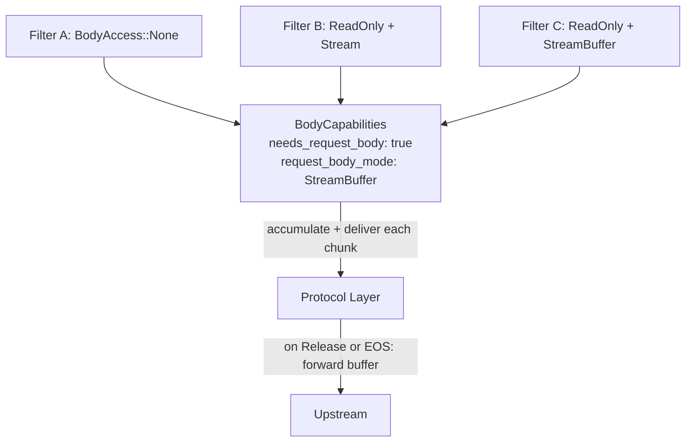

# Payload Processing

Filters declare body access needs at construction time via
`request_body_access()`, `response_body_access()`, and the
corresponding `*_body_mode()` methods. The pipeline
pre-computes aggregate `BodyCapabilities` at build time so
the protocol layer knows whether to buffer or stream.

Two delivery modes:

- **Stream**: chunks flow through filters as they arrive.
  Low latency, low memory.
- **StreamBuffer**: chunks are delivered to filters
  incrementally (like Stream) but accumulated in a buffer
  and not forwarded to upstream until a filter returns
  `FilterAction::Release` or end-of-stream. After release,
  remaining chunks flow through in stream mode. No size
  limit by default; an optional `max_bytes` returns 413
  when exceeded. Enables streaming inspection with deferred
  forwarding for protocol parsing, body-based routing, and
  security use cases including content scanning,
  payload inspection, and body-based routing.

When StreamBuffer mode is active, the protocol layer
pre-reads the body during the request phase (before
upstream selection) so that body filters can influence
routing decisions. The pre-read body is stored and
forwarded to the upstream after the connection is
established.

Precedence: `StreamBuffer` > `SizeLimit` > `Stream`. If
any filter requests `StreamBuffer`, the pipeline uses
stream-buffered mode.
Global `body_limits.max_request_bytes` / `body_limits.max_response_bytes`
config limits force buffer mode for size enforcement even
when no filter requests body access.

The `on_response_body` hook is synchronous (not async)
because Pingora's `response_body_filter` callback is `fn`,
not `async fn`.

## Filter Condition System

Filters can be conditionally executed based on request or
response attributes. Each `FilterEntry` carries optional
`conditions` (request phase) and `response_conditions`
(response phase).

Condition types:

- **`when`**: execute the filter only if the predicate
  matches
- **`unless`**: skip the filter if the predicate matches

Request predicates: `path`, `path_prefix`, `methods`,
`headers`. Response predicates: `status`, `headers`. All
fields within a predicate use AND semantics; multiple
conditions short-circuit in order.

Request conditions gate both `on_request` and body hooks.
Response conditions gate only `on_response` and response
body hooks.

## Related

- [Architecture Overview](overview.md)
- [Connection Lifecycle](connection-lifecycle.md)
- [Filter System](../filters/README.md)
