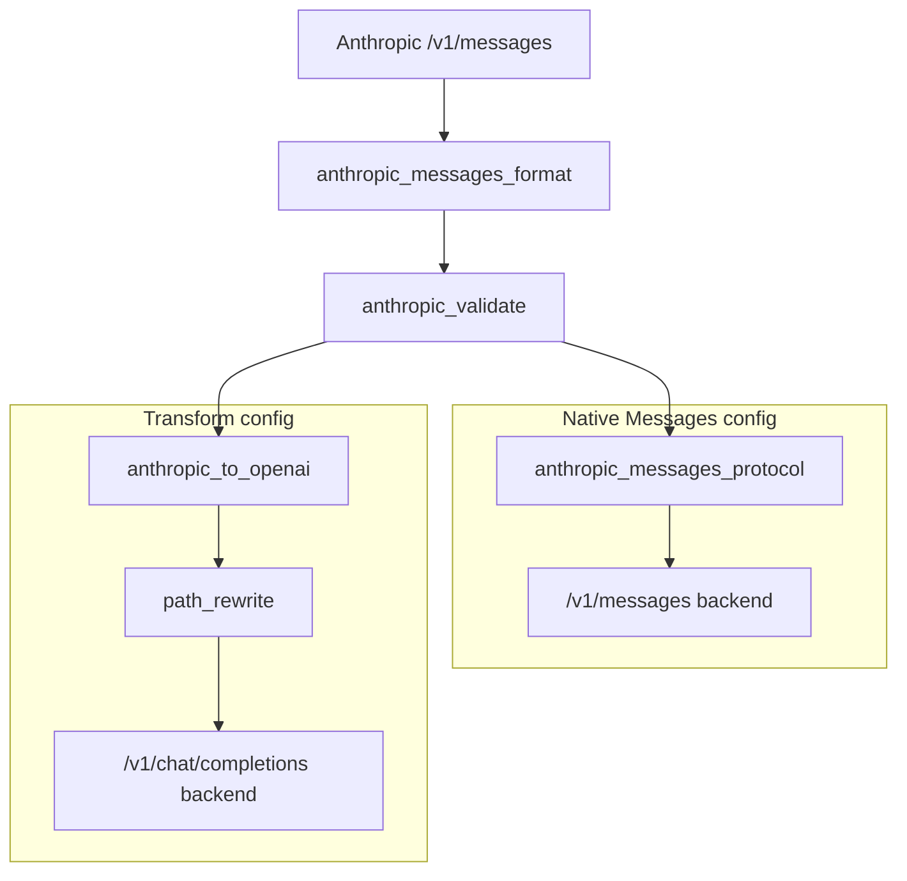

# Anthropic Messages API Filters

## What?

Add Anthropic Messages API support to Praxis as
composable filters, mirroring the pattern established
by the `OpenAI` Responses API filters in #354. This
enables Praxis to classify, route, and transform
requests between the `Anthropic` Messages API
(`/v1/messages`) and `OpenAI` Chat Completions
(`/v1/chat/completions`).

The `OpenAI` Responses API (`/v1/responses`) is a
fundamentally different protocol with stateful
semantics and is out of scope for format
transformation. Responses API support is covered
separately.

The scope covers five capabilities:

1. **Classification and routing**: detect `Anthropic`
   Messages API requests by body structure and
   promote routing facts to headers for downstream
   routing and cluster selection. The
   classifier extends the shared `AiRequestFormat`
   enum (at `ai/classifier/`) with an
   `AnthropicMessages` variant, keeping a single
   classifier for all formats. It must distinguish
   `Anthropic` Messages from `OpenAI` Chat
   Completions even though both use a `messages`
   field, using discriminating signals: top-level
   `system` parameter, required `max_tokens`,
   `anthropic-version` header, and typed content
   blocks. Mid-conversation system messages
   (`"role": "system"` inside the messages array)
   are supported on newer `Anthropic` models per
   the [mid-conversation system messages docs].
   The `anthropic-version` header is the strongest
   signal. The promoted header name is
   `x-praxis-ai-format` (matching the existing
   `openai_responses_format` filter convention).

   [mid-conversation system messages docs]: https://platform.claude.com/docs/en/build-with-claude/mid-conversation-system-messages

2. **Request validation**: validate only request
   properties the gateway or filters must act on
   locally. All other fields are forwarded to the
   inference backend unmodified; the backend handles
   Anthropic API requirements such as required fields,
   parameter types and ranges, model availability, role
   ordering, and content-level validation. Unknown
   fields are expected and must be preserved. Unlike
   the Responses API, `Anthropic` Messages does not
   require persistence or stateful orchestration, so
   the validation filter is lighter: no shared state
   struct, no store initialization.

3. **Format transformation**: bidirectional conversion
   between `Anthropic` Messages and `OpenAI` Chat
   Completions so that clients speaking one dialect
   can reach backends speaking the other. This filter
   is only needed when the backend does not natively
   support `/v1/messages` (e.g. OpenAI-only backends).
   Backends with native Messages support use the
   passthrough path instead. This is
   validated by existing production implementations
   in OGX (the open-source agentic API server) which
   performs the same translation in Python. The known
   mapping rules are:

   **Request (`Anthropic` to `OpenAI`):**
   - `system` (top-level string or text block array)
     to prepended `OpenAI` message with
     `role: "system"`
   - Content blocks flattened:
     - `type: "text"` to string content
     - `type: "tool_use"` to `OpenAI` `tool_calls`
       with `function.arguments = JSON-serialized
       input`
     - `type: "tool_result"` to separate `OpenAI`
       message with `role: "tool"` (images in tool
       results promoted to follow-up user messages
       since `OpenAI` tool messages are text-only)
   - `max_tokens` to `max_tokens` (direct mapping)
   - `stop_sequences` to `stop`
   - `tool_choice`: `"any"` to `"required"`,
     `"none"` to `"none"`, default to `"auto"`,
     `{"type": "tool", "name": "X"}` to
     `{"type": "function", "function": {"name": "X"}}`
   - Tool definitions: custom tools convert
     (`input_schema` to `parameters`); server-side
     tools (web_search, bash, text_editor) are
     dropped with a log warning
   - `top_k`: no standard `OpenAI` equivalent,
     passed as extra body parameter for backends
     that support it (e.g. vLLM)
   - `temperature`, `top_p`: forwarded as-is.
     Model-specific stripping (e.g. for Opus 4.7+
     which rejects non-default values) is deferred
     to future work
   - `thinking` blocks: dropped (no `OpenAI`
     equivalent)
   - Image blocks: `Anthropic` uses `type: "image"`
     with `source.type: "base64"|"url"|"file"`;
     `OpenAI` uses `type: "image_url"` with
     `image_url.url`. For `source.type: "base64"`
     and `"url"`, structural mapping is applied.
     For `source.type: "file"`, the file reference
     must be resolved to a data URL before
     transformation (requires a separate file
     resolver; deferred to future work)

   **Response (`OpenAI` to `Anthropic`):**
   - `message.content` string to content block
     with `type: "text"`
   - `tool_calls` to content block per call with
     `type: "tool_use"` and `input = JSON-parsed
     arguments`
   - Finish reason mapping:
     `"stop"` to `"end_turn"`,
     `"tool_calls"` to `"tool_use"`,
     `"length"` to `"max_tokens"`,
     `"content_filter"` to `"end_turn"` (note:
     this is a lossy mapping; the original
     `finish_reason` is preserved in filter
     metadata as `openai.finish_reason` so
     downstream filters can distinguish
     safety-filtered responses from natural
     completions)
   - Usage: `prompt_tokens` to `input_tokens`,
     `completion_tokens` to `output_tokens`,
     `cached_tokens` to `cache_read_input_tokens`
   - Set `id` to an Anthropic-style `msg_` ID,
     derived from upstream ID when present

4. **Streaming SSE transformation**: a separate
   filter (following the `stream_events` pattern in
   #354) that transforms OpenAI Chat Completions SSE
   chunks into Anthropic Messages SSE events. Decoupled
   from request body transformation so operators can
   use SSE event handling independently (e.g. for
   logging or guardrails on passthrough streams).

   **Event mapping (`OpenAI` chunks to `Anthropic` SSE):**
   1. Emit `MessageStartEvent` with empty content
   2. Per text delta: `ContentBlockStartEvent` +
      `ContentBlockDeltaEvent(text_delta)`
   3. Per tool call delta:
      `ContentBlockStartEvent` with empty
      `ToolUseBlock`, then
      `ContentBlockDeltaEvent(input_json_delta)`
   4. `ContentBlockStopEvent` to close each block
   5. `MessageDeltaEvent` with final `stop_reason`
      and usage
   6. `MessageStopEvent`

5. **`Anthropic`-native features**: proxy and preserve
   `Anthropic`-specific capabilities that have no
   `OpenAI` equivalent when routing to `Anthropic`
   backends in pass-through mode:
   - Prompt caching (`cache_control` blocks with
     `ephemeral` type; 5-minute TTL is standard,
     1-hour TTL requires the `extended-cache-ttl`
     beta header)
   - Extended thinking (`thinking` parameter with
     `budget_tokens`)
   - Citations in responses
   - `Anthropic` SSE streaming event protocol
   - `anthropic-version` header preservation
   - Rate-limit header forwarding
     (`x-ratelimit-limit-tokens`, etc.) — deferred
     to future work

Each capability is a separate filter implementing
`HttpFilter`, composable in YAML pipelines. Operators
deploy only what they need.

### Goals

- Validate proxy-needed fields in `Anthropic`
  Messages requests (`messages` non-empty,
  `max_tokens` > 0, `model` present) and reject
  malformed requests with consistent error responses
  before they reach the backend.
- Classify `Anthropic` Messages API requests and
  promote `x-praxis-ai-format: anthropic_messages`
  to headers for routing, extending the existing
  `AiRequestFormat` enum alongside `Responses` and
  `ChatCompletions` variants (`openai_responses` and
  `openai_chat_completions` as string values).
- Transform requests bidirectionally between
  `Anthropic` Messages and `OpenAI` Chat Completions
  using the mapping rules documented above,
  validated against OGX's production implementation.
- Transform OpenAI Chat Completions SSE chunks
  (`chat.completion.chunk`) into Anthropic Messages
  SSE events (`message_start`, `content_block_start`,
  `content_block_delta`, `content_block_stop`,
  `message_delta`, `message_stop`).
- Gracefully degrade when transforming `Anthropic`
  requests for `OpenAI` backends: drop unsupported
  features (thinking, server-side tools,
  `cache_control`) with structured log warnings
  rather than rejecting the request.
- Preserve `Anthropic`-specific headers and request
  features end-to-end when routing to backends
  that natively support `/v1/messages` (e.g. vLLM,
  `Anthropic` API).
- Provide a pass-through fast path for backends
  that natively support `/v1/messages` with
  sub-millisecond proxy overhead.
- Support credential injection for `Anthropic`
  backends using the existing `credential_injection`
  filter for `x-api-key` and `anthropic_messages_protocol`
  for gateway-managed `anthropic-version` defaults.
- Enable unified gateway configurations where a
  single Praxis instance routes to vLLM (`OpenAI`),
  llm-d (`OpenAI` via vLLM), KServe/MaaS backends,
  and `Anthropic` API simultaneously, with format
  detection at request time and operator-configured
  filter chains for passthrough or transformation.
  Runtime backend capability detection is out of
  scope.

## Why?

### Motivation

Production AI platforms increasingly need to support
multiple inference backends and API formats
simultaneously. The `Anthropic` Messages API is a
first-class inference protocol alongside `OpenAI`'s
Chat Completions and Responses APIs, with
significant adoption in enterprise deployments.

Today, Praxis classifies requests as either
`Responses` (`OpenAI` Responses API) or
`ChatCompletions` (`OpenAI` Chat Completions) in the
`AiRequestFormat` enum. `Anthropic` Messages requests
arrive with `messages` (like Chat Completions) but
are structurally different: `system` is a top-level
parameter, `max_tokens` is required, content uses
typed blocks (`text`, `image`, `tool_use`,
`tool_result`), and streaming uses a distinct SSE
event protocol. The current classifier would
misidentify these as `chat_completions`, leading to
incorrect routing or transformation failures.

The format transformation filters are needed because
real deployments mix backends:

- **vLLM and llm-d** expose `OpenAI`-compatible
  endpoints (`/v1/chat/completions`) and also
  support `/v1/messages` natively, but not all
  deployments enable `Anthropic` compatibility.
  vLLM's `/v1/messages` endpoint supports core
  `Anthropic` features (system, tools, tool_choice,
  thinking blocks, streaming SSE) but does not
  support `cache_control` or `budget_tokens` (these
  are accepted but ignored). llm-d is a
  Kubernetes-native orchestration layer that
  routes to vLLM workers using the Gateway API
  Inference Extension with prefix-cache-aware
  scheduling and prefill/decode disaggregation.
- **KServe and MaaS** (Models as a Service) provide
  model discovery and API key management. MaaS
  returns model URLs that clients call directly;
  the model endpoints may implement either format.
  MaaS uses `OpenAI`-compatible API keys
  (`sk-oai-*`) and `/v1/models` for discovery.
- **`Anthropic` API** is the canonical backend for
  Claude models and uses a distinct wire format
  with features that have no `OpenAI` equivalent:
  prompt caching with `cache_control` blocks
  (5-minute TTL standard; 1-hour TTL requires the
  `extended-cache-ttl` beta header), extended
  thinking with `budget_tokens`, typed content
  blocks, and a block-based SSE streaming protocol.
  `Anthropic` also provides an `OpenAI`
  compatibility endpoint at `/v1/chat/completions`,
  but it lacks prompt caching, extended thinking
  details, and strict tool use, making native
  `/v1/messages` routing necessary for full feature
  access.

The bidirectional format transformation is a
validated pattern. OGX (the open-source agentic API
server) implements the same `Anthropic` to `OpenAI`
mapping in production, with a native-passthrough
fast path when backends support `/v1/messages`
directly. The mapping rules documented in this
proposal are derived from that implementation and
cover the known edge cases: tool result image
promotion, server-side tool filtering, thinking
block handling, and streaming event sequencing.

Without format transformation, operators must either
standardize all clients on one format (impractical)
or run separate gateway instances per format
(operationally expensive). Praxis should handle this
at the filter pipeline level.

`Anthropic`-native features (prompt caching, extended
thinking) represent capabilities that cannot be
expressed in `OpenAI` format. When routing to
`Anthropic` backends, these must be preserved
end-to-end. When routing `Anthropic` requests to
`OpenAI`-compatible backends, the filters must
gracefully degrade: strip unsupported fields, map
what can be mapped, and log what was dropped.

### User Stories

- As a platform engineer, I want to route
  `/v1/messages` requests to vLLM backends that
  only support `/v1/chat/completions` so that
  clients using the `Anthropic` SDK can reach any
  backend in my fleet.
- As an AI gateway operator, I want a single Praxis
  instance to serve clients speaking `OpenAI` Chat
  Completions and `Anthropic` Messages formats,
  routing each to the appropriate backend with
  automatic format detection.
- As a developer, I want to send `Anthropic`-format
  requests with prompt caching to a Claude backend
  through Praxis without losing the `cache_control`
  blocks or `anthropic-version` header.
- As an SRE, I want to use Praxis credential
  injection to manage `x-api-key` headers for
  `Anthropic` backends the same way I manage
  `Authorization: Bearer` headers for `OpenAI`
  backends.
- As a platform engineer using MaaS for model
  discovery, I want to configure Praxis filter
  chains per backend format so that clients
  speaking `Anthropic` can reach any endpoint
  regardless of its native API format.

### Translation Decision

The classifier detects the request format (always
`anthropic_messages` for `Anthropic` requests) but
does not determine whether the backend needs
translation. This follows the existing Praxis
classify → route pattern: the classifier promotes
facts to internal headers. The operator chooses
the pipeline at deployment time (via listener and
filter chain config); routes select clusters
within that pipeline at runtime.

The operator deploys separate configs (or separate
listeners) for native Messages vs transformation. The
native Messages config includes `anthropic_messages_protocol`
in the pipeline for protocol header normalization; the transformation config includes
`anthropic_to_openai`. In Praxis, listeners flatten
filter chains at startup and the router selects
clusters, not chains — so the translation decision
is a deployment-time config choice, not a runtime
routing decision.

This is the same pattern used by `openai_responses_format`
for Responses API vs Chat Completions routing. See
`examples/configs/ai/openai/responses/format-routing.yaml`
for the canonical example.

## How?

### Filter Summary

Five composable filters, each implementing `HttpFilter`.
Operators deploy only what they need for their use case.



| Filter | Purpose |
|--------|---------|
| `anthropic_messages_format` | Classify requests as Anthropic Messages and promote routing facts to headers, metadata, and filter results |
| `anthropic_validate` | Validate proxy-needed fields (`messages`, `max_tokens`, `model`) and reject malformed requests with 400 |
| `anthropic_messages_protocol` | Supply a gateway-managed `anthropic-version` default for native `/v1/messages` backends |
| `anthropic_to_openai` | Transform Anthropic request body to OpenAI Chat Completions and non-streaming response back |
| `anthropic_stream_events` | Transform OpenAI Chat Completions SSE chunks into Anthropic Messages SSE events per-chunk |

### Source Material

- `Anthropic` Messages API docs:
  https://platform.claude.com/docs/en/api/messages
- [OGX](https://github.com/ogx-ai/ogx/)
  transformation reference at
  `ogx/src/ogx/providers/inline/messages/impl.py`
- Target: `filter/src/builtins/http/ai/anthropic/`
  in praxis

### Architecture

Five filters, each implementing `HttpFilter`.
Filters communicate via `HttpFilterContext`:
- `filter_metadata`: durable key-value state
  persisting across lifecycle phases
- `filter_results`: ephemeral key-value pairs
  consumed by branch conditions
- `extra_request_headers`: headers injected into
  upstream requests
- Request/response body access via
  `on_request_body` / `on_response_body`

The classifier extends the existing
`AiRequestFormat` enum (moved to
`filter/src/builtins/http/ai/classifier/mod.rs` as
a shared module) with an `AnthropicMessages`
variant. The operator configures routes and filter
chains for passthrough vs transformation using the
existing classify → route pattern (see Translation
Decision above).

---

### Filter 0: `anthropic_messages_format`

**Purpose:** Classify requests as `Anthropic` Messages
API and promote routing facts to headers, metadata,
and filter results. Mirrors the pattern of
`openai_responses_format` but detects `/v1/messages`
requests.

**Praxis trait methods:**
- `on_request_body`: parse JSON body, classify
  format, write metadata and headers
- `request_body_mode` → `StreamBuffer` (read-only)

**Classification logic (decision tree):**

The pure classifier (`classify_request_body`) uses
body structure only. The filter layer applies
header and path overrides after classification.

Body classification precedence:
1. `input` field present → `Responses`
2. `messages` + `max_tokens` + Anthropic signals
   → `AnthropicMessages`
3. `messages` without the above → `ChatCompletions`
4. Neither `input` nor `messages` → `UnknownJson`

Anthropic signals (required beyond `max_tokens`):
- Top-level `system` field, OR
- Typed content blocks in `messages` (arrays of
  objects with a `type` key)

Filter-layer overrides (checked in the filter, not
the pure classifier):
- `anthropic-version` request header present →
  override to `AnthropicMessages`
- Request path is `/v1/messages` → override to
  `AnthropicMessages`

This prevents false positives when OpenAI Chat
Completions requests include the optional
`max_tokens` field.

Classification result:
- Extends `AiRequestFormat` with
  `AnthropicMessages` variant
- `as_str()` returns `"anthropic_messages"`

**Promoted facts:**
- `x-praxis-ai-format: anthropic_messages`
- `x-praxis-ai-model: <model>` (extracted from
  body)
- `x-praxis-ai-stream: true|false`
- `filter_metadata`: `anthropic_format.format`,
  `anthropic_format.model`,
  `anthropic_format.stream`,
  `anthropic_format.max_tokens`
- `filter_results` (under key
  `anthropic_messages_format`): `format`,
  `model`, `stream`

**Config:**

```yaml
filter: anthropic_messages_format
on_invalid: continue  # continue | reject
max_body_bytes: 1048576  # 1 MiB
headers:
  format: x-praxis-ai-format
  model: x-praxis-ai-model
  stream: x-praxis-ai-stream
```

---

### Filter 1: `anthropic_validate`

**Purpose:** Validate proxy-needed fields in
`Anthropic` Messages requests before forwarding.
Unlike #354's `request_validate`, this filter does
not create shared orchestrator state or initialize
persistence: `Anthropic` Messages has no stateful
orchestration.

**Praxis trait methods:**
- `on_request_body`: parse JSON body, validate
  fields, reject with 400 if invalid
- `request_body_mode` → `StreamBuffer` (read-only)

**Validation checks:**
- `messages` array exists and is non-empty
- `max_tokens` is present and > 0
- `model` is present and non-empty

**Validation principle:** Only validate what the
proxy needs for its own operation. Let the inference
server handle parameter ranges, model availability,
and content-level validation. Forward unknown fields
as-is.

**Config:**

```yaml
filter: anthropic_validate
max_body_bytes: 1048576  # 1 MiB
```

---

### Filter 2: `anthropic_to_openai`

**Purpose:** Transform an `Anthropic` Messages API
request body into an OpenAI Chat Completions request
body. Runs on the request path. Enables Anthropic
SDK clients to reach OpenAI-compatible backends
(vLLM, llm-d, KServe).

**Praxis trait methods:**
- `on_request_body`: rewrite JSON body
- `request_body_mode` → `StreamBuffer`
  (read-write)
- `response_body_mode` → `Stream` (static default)
- `on_response`: upgrade to `StreamBuffer` via
  `ctx.set_response_body_mode()` only when request
  metadata says `stream != "true"`
- `on_response_body`: transform non-streaming
  response body from OpenAI format back to
  Anthropic format; no-op for streaming requests
  (handled by `anthropic_stream_events`)

**Streaming coexistence:** by declaring `Stream`
statically and upgrading to `StreamBuffer` per-request,
both `anthropic_to_openai` and
`anthropic_stream_events` can coexist in a single
pipeline. Non-streaming requests get full response
buffering for transformation; streaming requests
pass through to `anthropic_stream_events` for
per-chunk SSE conversion.

**Request transformation (Anthropic → OpenAI):**

- Hoist `system` → prepend OpenAI message with
  `role: "system"`. Handles both string and text
  block array forms.
- Flatten content blocks in each message:
  - `type: "text"` → string content or OpenAI
    text content part
  - `type: "image"` with `source.type: "base64"`
    → OpenAI `type: "image_url"` with data URL
  - `type: "image"` with `source.type: "url"`
    → OpenAI `type: "image_url"` with URL
  - `type: "tool_use"` → OpenAI `tool_calls`
    entry with `function.arguments =
    serde_json::to_string(input)`
  - `type: "tool_result"` → separate OpenAI
    message with `role: "tool"`, `tool_call_id`,
    and string content. Images in tool results
    promoted to follow-up user messages.
  - `type: "thinking"` → dropped (logged)
  - `type: "redacted_thinking"` → dropped (logged)
- Map parameters:
  - `max_tokens` → `max_tokens`
  - `stop_sequences` → `stop`
  - `temperature` → `temperature` (forwarded as-is)
  - `top_p` → `top_p` (forwarded as-is)
  - `top_k` → extra body parameter
- Map `tool_choice`:
  - `"any"` → `"required"`
  - `"none"` → `"none"`
  - `"auto"` → `"auto"`
  - `{"type": "tool", "name": "X"}` →
    `{"type": "function", "function":
    {"name": "X"}}`
- Map `tools`:
  - Custom tools: `input_schema` → `parameters`,
    `name` → `function.name`,
    `description` → `function.description`
  - Server-side tools (`web_search_*`, `bash_*`,
    `text_editor_*`): dropped with
    `tracing::warn!`
- Rewrite `Content-Type` and `Content-Length`
  headers
- Strip `anthropic-version` and `x-api-key`
  headers (credential injection handles upstream
  auth)

**Response transformation (OpenAI → Anthropic):**

Non-streaming:
- `choices[0].message.content` → content block
  with `type: "text"`
- `choices[0].message.tool_calls` → content
  blocks with `type: "tool_use"`, `id`,
  `name`, `input = serde_json::from_str(args)`
- `finish_reason` → `stop_reason`:
  `"stop"` → `"end_turn"`,
  `"tool_calls"` → `"tool_use"`,
  `"length"` → `"max_tokens"`,
  `"content_filter"` → `"end_turn"` (lossy;
     original preserved in filter metadata)
- `usage.prompt_tokens` → `input_tokens`,
  `usage.completion_tokens` → `output_tokens`,
  `usage.prompt_tokens_details.cached_tokens`
  → `cache_read_input_tokens`
- Set `id` to `msg_` prefix + upstream ID when
  present, set `type: "message"`,
  `role: "assistant"`

**Config:**

```yaml
filter: anthropic_to_openai
max_body_bytes: 1048576  # 1 MiB
```

---

### Filter 3: `anthropic_stream_events`

**Purpose:** Transform OpenAI Chat Completions SSE
chunks into Anthropic Messages SSE events. Separated
from request
transformation so operators can use SSE event
handling independently: e.g. for logging, metrics,
or guardrails on passthrough streams without
transforming the request body.

**Praxis trait methods:**
- `on_response_body`: process each TCP chunk as it
  arrives, transform complete SSE events immediately,
  buffer only partial lines across chunk boundaries
- `response_body_mode` → `Stream` (not `StreamBuffer`;
  no full-response buffering)

**Per-chunk processing:**
Each `on_response_body` call:
1. Combines leftover partial data from the previous
   chunk with new bytes
2. Splits on `\n\n` SSE event boundaries
3. Transforms each complete `data:` line immediately
4. Stores any trailing partial data in filter metadata
5. Forwards transformed events to the client

This conforms to the [Inference Proxy Conformance
Guidelines] Sections 4.2 (no streaming-to-non-streaming
conversion) and 4.3 (no full-response buffering).

[Inference Proxy Conformance Guidelines]: https://docs.google.com/document/d/1yDzs9ehHFxqYbufOmY-sEXiEtn9nhXUKHx4uKjasC5Q/edit?tab=t.0

**State machine (per-request, stored in filter metadata):**
- Track: current block index, block type, open
  blocks, finish reason, output tokens
- First chunk → `message_start` with empty
  message envelope
- Text delta → `content_block_start` (first),
  then `content_block_delta(text_delta)`
- Tool call delta → `content_block_start` with
  empty `tool_use` block (first per tool), then
  `content_block_delta(input_json_delta)`
- Block end → `content_block_stop`
- `[DONE]` → `message_delta` with `stop_reason`
  and `usage`, then `message_stop`

**Config:**

```yaml
filter: anthropic_stream_events
```

---

### Filter 4: `anthropic_messages_protocol`

**Purpose:** Normalize Anthropic Messages protocol
headers when routing to backends that natively
support `/v1/messages` (`Anthropic` API, vLLM with
Anthropic endpoint). No body transformation: only
gateway-managed `anthropic-version` defaulting and
credential injection coordination.

**Praxis trait methods:**
- `on_request`: inject `anthropic-version` header
  if absent

**Behavior:**

Request:
- Inject `anthropic-version` header with configured
  default if an internal or non-SDK client did not
  send one
- Preserve caller-provided `anthropic-version`
  headers
- Preserve `cache_control` blocks in body as-is
- Preserve `thinking` parameter as-is
- Coordinate with `credential_injection` filter
  for `x-api-key` header injection

Response:
- Pass through unchanged (no body or header
  transformation)

**Future:** Rate-limit header forwarding
(`x-ratelimit-*`) and `request-id` passthrough
are deferred to a follow-up.

**Config:**

```yaml
filter: anthropic_messages_protocol
default_version: "2023-06-01"
```

---

### Filter Chain Configuration

#### Internal or Anthropic client → native backend:

```yaml
listeners:
  - name: anthropic-gateway
    address: "127.0.0.1:8080"
    filter_chains: [anthropic-native]

filter_chains:
  - name: anthropic-native
    filters:
      - filter: anthropic_messages_format
        on_invalid: continue

      - filter: anthropic_messages_protocol
        default_version: "2023-06-01"

      - filter: router
        routes:
          - path_prefix: "/"
            cluster: "anthropic-backend"

      - filter: load_balancer
        clusters:
          - name: "anthropic-backend"
            endpoints:
              - "127.0.0.1:3001"
```

#### Anthropic client → OpenAI backend (transform):

```yaml
listeners:
  - name: anthropic-gateway
    address: "127.0.0.1:8080"
    filter_chains: [anthropic-transform]

filter_chains:
  - name: anthropic-transform
    filters:
      - filter: anthropic_messages_format
        on_invalid: continue

      - filter: anthropic_to_openai
        max_body_bytes: 1048576

      - filter: path_rewrite
        replace:
          pattern: "^/v1/messages$"
          replacement: "/v1/chat/completions"
        conditions:
          - when:
              path_prefix: "/v1/messages"

      - filter: router
        routes:
          - path_prefix: "/"
            cluster: "openai-backend"

      - filter: load_balancer
        clusters:
          - name: "openai-backend"
            endpoints:
              - "127.0.0.1:3001"
```

#### Unified gateway (route by format):

Uses a single filter chain with both classifiers;
the router selects clusters by path. Note: branch
chains cannot be
used for transformation because body hooks
(`on_request_body`, `on_response_body`) are not
executed for filters inside branch chains.

```yaml
listeners:
  - name: unified-gateway
    address: "127.0.0.1:8080"
    filter_chains: [unified-routing]

filter_chains:
  - name: unified-routing
    filters:
      - filter: anthropic_messages_format
        on_invalid: continue
        headers:
          format: x-praxis-ai-format
          model: x-praxis-ai-model
          stream: x-praxis-ai-stream

      - filter: openai_responses_format
        on_invalid: continue

      - filter: router
        routes:
          - path: "/v1/messages"
            cluster: "anthropic-backend"
          - path: "/v1/chat/completions"
            cluster: "openai-backend"
          - path: "/v1/responses"
            cluster: "responses-backend"
          - path_prefix: "/"
            cluster: "default-backend"

      - filter: load_balancer
        clusters:
          - name: "anthropic-backend"
            endpoints:
              - "127.0.0.1:3001"
          - name: "openai-backend"
            endpoints:
              - "127.0.0.1:3002"
          - name: "responses-backend"
            endpoints:
              - "127.0.0.1:3003"
          - name: "default-backend"
            endpoints:
              - "127.0.0.1:3004"
```

---

### Implementation Tiers

Build order; each tier produces a working system:

| Tier | Filter | What works after |
|------|--------|------------------|
| 0 | `anthropic_messages_format` | Classification and routing. Anthropic requests detected and promoted to headers/metadata for downstream routing. |
| 1 | `anthropic_validate` | Request validation. Malformed requests rejected at the proxy with consistent error format. |
| 2 | `anthropic_messages_protocol` | Native Anthropic backend routing. Clients reach `Anthropic` API through Praxis with centralized `anthropic-version` defaults. |
| 3 | `anthropic_to_openai` (request + non-streaming response) | `Anthropic` SDK clients can reach vLLM/llm-d backends. Non-streaming responses translated back. |
| 4 | `anthropic_stream_events` | Per-chunk SSE streaming. `OpenAI` chunks translated to `Anthropic` events incrementally as they arrive. Conformant with [Inference Proxy Conformance Guidelines](https://docs.google.com/document/d/1yDzs9ehHFxqYbufOmY-sEXiEtn9nhXUKHx4uKjasC5Q/edit?tab=t.0). |

---

### File Structure in Praxis

```
filter/src/builtins/http/ai/
  classifier/
    mod.rs                       # shared AiRequestFormat enum
  anthropic/
    mod.rs                       # module exports
    messages_format/
      mod.rs                     # classifier filter
      config.rs                  # YAML config
    validate/
      mod.rs                     # validation filter
      config.rs                  # YAML config
    to_openai/
      mod.rs                     # transformation filter
      config.rs                  # YAML config
      request.rs                 # Anthropic → OpenAI request
      response.rs                # OpenAI → Anthropic response
    stream_events/
      mod.rs                     # per-chunk SSE transformation
      config.rs                  # YAML config
    protocol/
      mod.rs                     # protocol filter
      config.rs                  # YAML config

examples/configs/ai/anthropic/
  messages-protocol.yaml      # protocol header config
  messages-to-openai.yaml        # transformation config
  unified-gateway.yaml           # multi-format routing

tests/integration/tests/suite/examples/
  anthropic_messages.rs          # functional integration tests

tests/integration/tests/suite/
  anthropic_messages.rs          # ported OGX conformance tests
```

### Test Strategy

The integration tests are ported from
[OGX](https://github.com/ogx-ai/ogx/)'s Messages
test suite (`test_messages.py`), rewritten in Rust
to avoid Python dependencies in the repo. Each Rust
test maps 1:1 to its OGX Python counterpart by name.

Tests use `Backend::fixed()` with hardcoded
Anthropic Messages response fixtures. Each test
starts a mock backend, configures Praxis with the
protocol filter chain, sends an Anthropic
`/v1/messages` request, and validates the response
structure. No live backends or recording replay
servers are needed — fixtures are embedded in the
test file.

**Test coverage:**

| Rust test | OGX counterpart |
|-----------|-----------------|
| `non_streaming_basic` | `test_messages_non_streaming_basic` |
| `non_streaming_with_system` | `test_messages_non_streaming_with_system` |
| `non_streaming_multi_turn` | `test_messages_non_streaming_multi_turn` |
| `streaming_basic` | `test_messages_streaming_basic` |
| `streaming_collects_full_text` | `test_messages_streaming_collects_full_text` |
| `non_streaming_with_temperature` | `test_messages_non_streaming_with_temperature` |
| `non_streaming_with_stop_sequences` | `test_messages_non_streaming_with_stop_sequences` |
| `with_tool_definitions` | `test_messages_with_tool_definitions` |
| `tool_use_round_trip` | `test_messages_tool_use_round_trip` |
| `error_missing_model` | `test_messages_error_missing_model` |
| `error_empty_messages` | `test_messages_error_empty_messages` |
| `response_headers` | `test_messages_response_headers` |
| `content_block_array` | `test_messages_content_block_array` |

---

### Limitations

- **Token counting.** Transformed responses report
  the backend's token accounting in Anthropic field
  names (`prompt_tokens` → `input_tokens`,
  `completion_tokens` → `output_tokens`). These
  reflect the OpenAI backend's counts, not what
  Anthropic's tokenizer would produce. Synthesizing
  "true Anthropic" counts would require owning
  tokenizer fidelity, which is out of scope.

### Out of Scope (Future Proposals)

- **Batches API.** `/v1/messages/batches` involves
  async job lifecycle, storage, polling, result
  retrieval, and cancellation — not just body
  transformation. If supported, it should be a
  separate proposal and filter family. Native
  passthrough can route batch requests to backends
  that support them.

- **`/v1/messages/count_tokens`.** For native
  backends, passthrough works. For transformed
  backends, local implementation would require
  model-specific tokenizer config. Better addressed
  as a separate capability/filter if needed.
